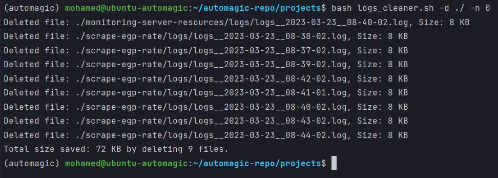
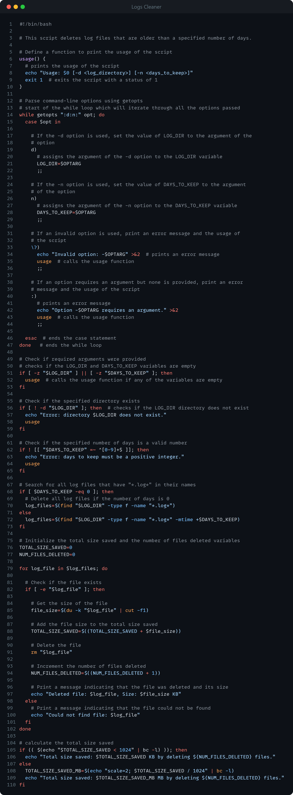

<!-- PROJECT SHIELDS -->
<!--
*** I'm using markdown "reference style" links for readability.
*** Reference links are enclosed in brackets [ ] instead of parentheses ( ).
*** See the bottom of this document for the declaration of the reference variables
*** for contributors-url, forks-url, etc. This is an optional, concise syntax you may use.
*** https://www.markdownguide.org/basic-syntax/#reference-style-links
-->

<a name="readme-top"></a>

[![LinkedIn][linkedin-shield]][linkedin-url]


<!-- PROJECT LOGO -->
<br />
<div align="center">
    

  <h3 align="center">Automated Logs Cleaner</h3>

</div>


<!-- TABLE OF CONTENTS -->
<details>
  <summary>Table of Contents</summary>
  <ol>
    <li>
      <a href="#about-the-project">About The Project</a>
      <ul>
        <li><a href="#built-with">Built With</a></li>
      </ul>
    </li>
    <li>
      <a href="#getting-started">Getting Started</a>
      <ul>
        <li><a href="#libraries">Libraries</a></li>
        <li><a href="#packages">Packages</a></li>
        <li><a href="#service-accounts">Service Accounts</a></li>
        <li><a href="#known-exceptions">Known Exceptions</a></li>
      </ul>
    </li>
    <li><a href="#usage">Usage</a></li>
    <li><a href="#roadmap">Roadmap</a></li>
    <li><a href="#license">License</a></li>
    <li><a href="#contact">Contact</a></li>
  </ol>
</details>


<!-- ABOUT THE PROJECT -->
## About The Project



* Project Name: Automated Logs Cleaner
* Version: v1.0.0

### Description
Looking to clean up your system and free up some space? 
This script is the solution for you! 

This script deletes log files that are older than a specified number of 
days, which is a helpful feature for maintaining your system's storage. 

With this script, you can save time and effort by automating the process 
of cleaning up your system. You can specify the log directory and the 
number of days to keep files in that directory. 

This script offers multiple benefits, including:
* Freeing up valuable disk space and helping to optimize system performance. 
* Provides the user with feedback on the total number of files deleted and 
the total size saved, giving you an idea of the impact the script 
has had on your system. 

Try out this script and enjoy a cleaner, more optimized system!

<p align="right">(<a href="#readme-top">back to top</a>)</p>


### Built With

This project was developed using the following tech stacks:

* Bash / Shell Scripting

<p align="right">(<a href="#readme-top">back to top</a>)</p>


<!-- GETTING STARTED -->
## Getting Started

In this section, I will give you instructions on setting up this project locally.
To get a local copy up and running follow these simple steps.

### Libraries

* None

### Packages
* None

### Service Accounts
* None

### Known Exceptions
* None

<p align="right">(<a href="#readme-top">back to top</a>)</p>


<!-- USAGE EXAMPLES -->
## Usage

To Run the script, use the below command:
```sh
  bash logs_cleaner.sh -d ./ -n 0
  ```
You should pass two parameters to the script:
* `-d` The root directory where the script should search for logs.
* `-n` The number of days to keep. If you want to delete all logs files, you
should pass `0` to this parameter. If you want to keep the last week of logs, you
should pass `7`.

### Screenshots



<p align="right">(<a href="#readme-top">back to top</a>)</p>


<!-- ROADMAP -->
## Roadmap

- [x] Take the root path and number of days to keep as inputs.
- [x] Validate inputs.
- [x] Get all files that include "*.log*" inside the specified directory
and delete them.
- [x] Display each file that was deleted with its size.
- [x] Display a final report with the number of files that were
deleted and the total saved size.

<p align="right">(<a href="#readme-top">back to top</a>)</p>

<!-- LICENSE -->
## License

Distributed under the MIT License. See `LICENSE.txt` for more information.

<p align="right">(<a href="#readme-top">back to top</a>)</p>


<!-- CONTACT -->
## Contact

Mohamed AbdelGawad Ibrahim - [@m-abdelgawad](https://www.linkedin.com/in/m-abdelgawad/) - <a href="tel:+201069052620">+201069052620</a> - muhammadabdelgawwad@gmail.com

GitHub Profile Link: [https://github.com/m-abdelgawad](https://github.com/m-abdelgawad)

<p align="right">(<a href="#readme-top">back to top</a>)</p>


<!-- MARKDOWN LINKS & IMAGES -->
<!-- https://www.markdownguide.org/basic-syntax/#reference-style-links -->
[linkedin-shield]: https://img.shields.io/badge/-LinkedIn-black.svg?style=for-the-badge&logo=linkedin&colorB=555
[linkedin-url]: https://www.linkedin.com/in/m-abdelgawad/
